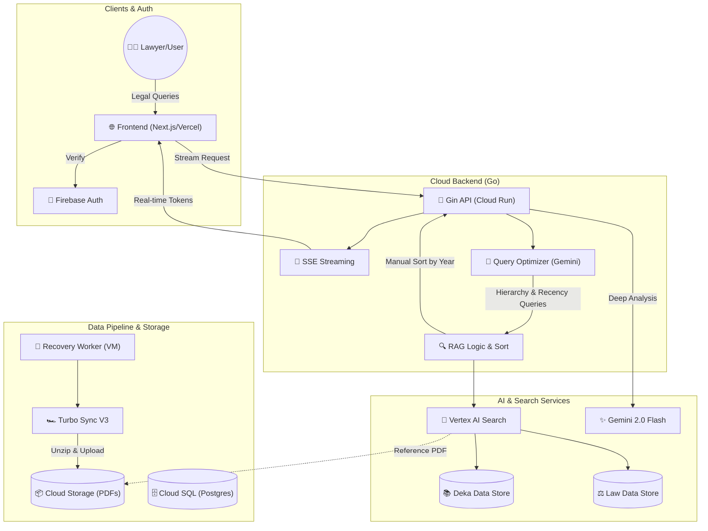

# 🏗️ Sue.AI System Architecture

เอกสารนี้แสดงโครงสร้างสถาปัตยกรรมล่าสุดของ Sue.AI ผู้ช่วยวิจัยกฎหมายระดับสูง (Senior Legal Associate AI)

## 📊 System Overview Diagram

---

## 🏛️ 3 แกนหลักความฉลาดทางกฎหมาย (Legal Intelligence Core)

ระบบถูกออกแบบโดยยึดหลัก **"Legal RAG 3.0"** เพื่อความแม่นยำสูงสุด:

1.  **ศักดิ์ของกฎหมาย (Law Hierarchy)**: ระบบเรียงลำดับความสำคัญของตัวบท (รัฐธรรมนูญ > ประมวลฯ > พรบ. > กฎกระทรวง) ในการวิเคราะห์
2.  **ความสดใหม่ (Recency Priority)**: 
    *   **Optimization**: เติมคำค้นหา "ปีล่าสุด" อัตโนมัติ
    *   **Logic**: ทำ Manual Sort ผลลัพธ์ใน Backend เรียงตามปีล่าสุดก่อนส่งให้ AI
3.  **สถานะ (Validity)**: AI ตรวจสอบและระบุฉบับแก้ไขเพิ่มเติมล่าสุด/ฉบับที่ถูกยกเลิกอย่างชัดเจน

---

## 🔧 Component Details

### 1. 🌐 Frontend (Next.js)
*   **Smart Citations**: ระบบตรวจจับ "มาตรา" และ "เลขฎีกา" ในคำตอบเพื่อสร้าง Popup ดูเอกสารตัวเต็มทันที
*   **Legal UX**: ขั้นตอนการโหลดที่แสดงสถานะ (🔍 ค้นหา, ⚖️ วิเคราะห์, 📊 สรุป) เพื่อความ Professional

### 2. 🚀 Backend Service (Go)
*   **Persona**: ตั้งค่าเป็น "Senior Legal Associate" เน้นการวิเคราะห์ลึกซึ้ง (Subsumption) 
*   **Litigation Perspective Table**: บังคับ AI วิเคราะห์มุมมองทั้งฝั่งโจทก์และจำเลย รวมถึงโอกาสชนะคดี

### 3. 🔎 Search (Vertex AI Search)
*   **Dual Engine**: แยกการค้นหาคำพิพากษา (DEKA) และตัวบทกฎหมาย (LAW) เพื่อความแม่นยำในการอ้างอิง

### 4. 🚀 Data Pipeline (Turbo Sync V3)
*   **Performance**: ระบบ Streaming Unzip & Sync ความเร็วสูง (1,300+ ไฟล์/นาที) จัดการข้อมูล PDF กว่า 1.2 ล้านไฟล์

---

## 📁 Repository Structure
- `src/frontend`: Next.js Client
- `src/backend-go`: High-performance Go Gin Service
- `scripts/`: Power tools สำหรับการ Sync ข้อมูลและ Deployment
- `.agent/`: AI Workflows & Skills สำหรับการดูแลรักษาระบบ
