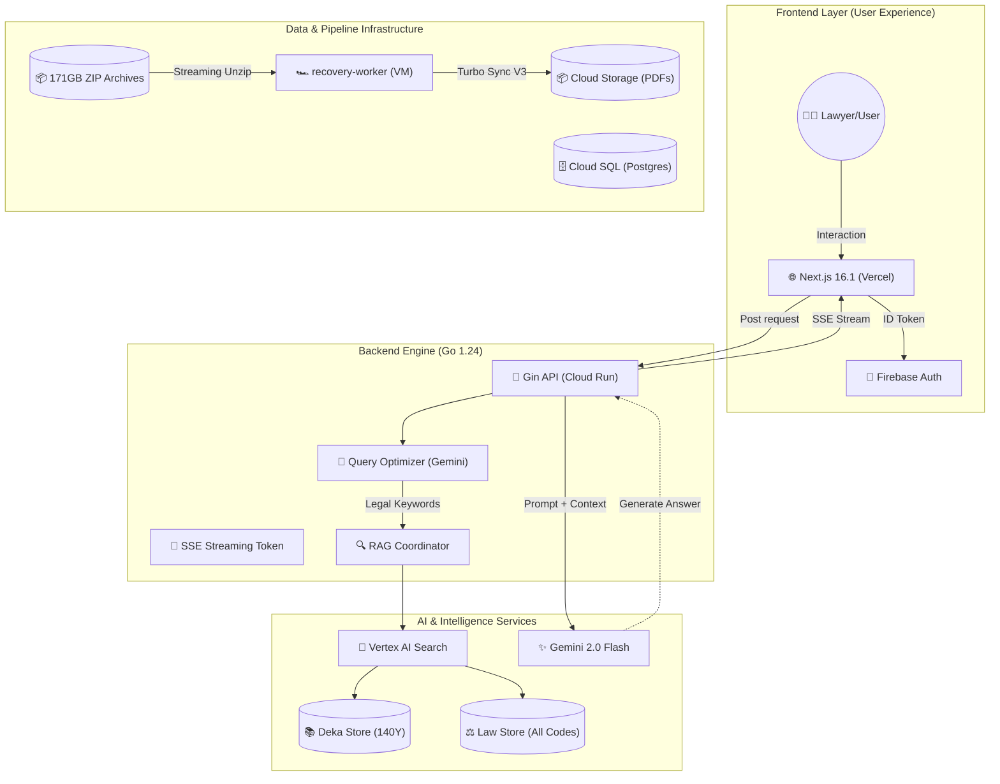

# 🏗️ Sue.AI System Architecture Design

โปรเจกต์ Sue.AI ออกแบบมาเพื่อเป็น **AI Paralegal** สำหรับทนายความไทย โดยใช้สถาปัตยกรรม **RAG (Retrieval-Augmented Generation)** ที่ล้ำสมัยบน Google Cloud Platform

---

## 🗺️ Visual Architecture Diagram

ระบบทำงานประสานกันผ่าน 4 เลเยอร์หลัก ดังนี้:

---

## 💎 Component Specification

| Component | Technology | Role & Responsibility |
| :--- | :--- | :--- |
| **Frontend** | **Next.js 16 (App Router)** | จัดการ UI แบบ Professional, รองรับ SSE สำหรับการตอบแบบ Streaming และระบบ Suggestion Cards สำหรับทนาย |
| **Backend** | **Golang 1.24** | หัวใจหลักในการประมวลผล (API), จัดการ Workflow ของ RAG และ Streaming Response ผ่านโพรโทคอล Event-Stream |
| **AI Model** | **Gemini 2.0 Flash** | ทำหน้าที่วิเคราะห์หลักกฎหมาย, ปรับบท (Subsumption) และสร้างคำตอบในรูปแบบที่ทนายความนำไปใช้ต่อได้จริง |
| **Search Engine** | **Vertex AI Search** | ทำหน้าที่ค้นหาในระดับ Semantic Search จากคำพิพากษาศาลฎีกาและมาตรากฎหมายกว่า 1.2 ล้านไฟล์ |
| **Storage** | **Google Cloud Storage** | เก็บไฟล์ต้นฉบับ PDF (Deka & Law) เพื่อให้ AI คืนค่า PDF Preview ให้ผู้ใช้เปิดอ่านได้ทันที |
| **Data Sync** | **Streaming V3 (Python)** | จัดการการย้ายข้อมูลขนาดใหญ่ (Large-scale migration) จาก Local VM ขึ้น Cloud แบบ Real-time |

---

## 🏛️ Implementation Strategy

### 1. Smart Query Optimization
เปลี่ยนคำถาม "ภาษาชาวบ้าน" (Natural Language) ให้เป็น "คำศัพท์ทางกฎหมาย" (Legal Terminology) ก่อนทำการค้นหา เพื่อความแม่นยำสูงสุด

### 2. Legal Professional Persona
AI ได้รับการปรับแต่ง (Fine-tuned Prompt) ให้ทำงานในฐานะ **Senior Legal Associate**:
- ✅ เน้นความถูกต้องของเลขฎีกา
- ✅ แสดงผลแบบตารางเทียบเคียง (Case Comparison)
- ✅ ประเมินความเสี่ยงทางคดี (Risk Assessment)

### 3. High-Performance Streaming
ใช้เทคโนโลยี Web Streams และ SSE เพื่อให้มั่นใจว่าทนายความไม่ต้องรอคำตอบนาน (Time-to-First-Token ต่ำกว่า 2 วินาที)

---

## 📈 Future Infrastructure Goals
- [ ] **Multi-Region Deployment**: เพิ่มความเสถียรของ API
- [ ] **Enhanced OCR Pipeline**: ปรับปรุงการอ่านลายมือในฎีกาเก่า (ก่อนปี 2500)
- [ ] **LawFi Integration**: เชื่อมต่อระบบบริหารจัดการสำนักงานทนายความ
