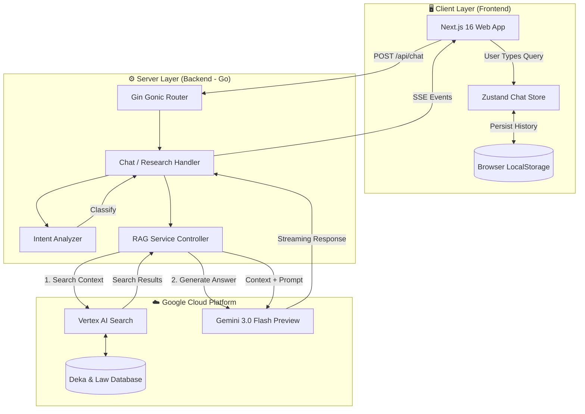

# 🏛️ Sue.AI (The Legal Board) - System Architecture

> **Last Updated:** February 2026
> **Version:** 2.0 (Gemini 3.0 Integration)

## 📌 1. High-Level Overview
Sue.AI is an advanced **Legal AI Assistant** designed to help lawyers and individuals navigate Thai Law. The system utilizes a **Retrieval-Augmented Generation (RAG)** architecture, combining the precision of **Google Vertex AI Search** (database of 200k+ Deka/Laws) with the reasoning power of **Gemini 3.0 Flash Preview**.

---

## 🏗️ 2. Architecture Diagram (Mermaid)



---

## 🛠️ 3. Technology Stack

### 🅰️ Frontend (The Face)
*   **Framework:** Next.js 16 (App Router, Turbopack)
*   **Language:** TypeScript
*   **Styling:** Tailwind CSS + Shadcn/UI
*   **State Management:** Zustand (with Custom Safe Storage Wrapper)
*   **Communication:** Server-Sent Events (SSE) for Real-time Streaming

### 🅱️ Backend (The Brain)
*   **Language:** Go (Golang) 1.22+
*   **Framework:** Gin Gonic (High-performance HTTP Web Framework)
*   **Concurrency:** Goroutines for handling multiple user streams simultaneously

### 🧠 AI & Data (The Core)
*   **LLM Model:** **Gemini 3.0 Flash Preview**
    *   *Why?* Lowest latency, high reasoning capability, and large context window.
*   **Search Engine:** **Google Vertex AI Search**
    *   *Data Source:* OCR processed Thai Supreme Court Rulings & Legal Codes.
    *   *Method:* Hybrid Search (Keyword + Semantic).

---

## 🔄 4. Data Flow Logic (The Pipeline)

### Phase 1: Request & Intent Analysis
1.  **User Input:** User types a question (e.g., "เลิกจ้างไม่เป็นธรรมต้องทำอย่างไร?").
2.  **Intent Classification:** The backend Agent analyzes the input:
    *   **SEARCH:** Complex legal questions -> Trigger RAG Pipeline.
    *   **ANSWER:** Greetings or follow-up -> AI answers directly using conversation history.
    *   **RESEARCH:** Specific comparison request -> Trigger Table Generator Mode.

### Phase 2: Retrieval (RAG)
1.  **Query Optimization:** The system rewrites the user's question into search-friendly keywords.
2.  **Vector Search:** Vertex AI retrieves the Top 10-15 most relevant documents.
3.  **Context Construction:** The system extracts "snippets" (up to 10k chars per doc) and compiles them into a "Database Context".

### Phase 3: Generation & Streaming
1.  **Prompt Engineering:** The system combines:
    *   System Persona ("Elite Legal Advisor")
    *   Conversation Memory (Last 10 turns)
    *   Database Context (Laws & Deka)
    *   User Question
2.  **Inference:** Gemini 3.0 processes the prompt.
3.  **Streaming:** Tokens are sent back to the frontend in real-time via SSE.

### Phase 4: Self-Healing Storage (Frontend)
*   The frontend monitors **LocalStorage Quota**.
*   If quota is exceeded, the **Auto-Cleanup Logic** activates:
    1.  Sorts chat sessions by date.
    2.  Deletes the oldest 20% of sessions.
    3.  Retries saving the new data.

---

## 📂 5. Folder Structure (Project Map)

```
Sue.AI/
├── src/
│   ├── backend-go/           # Go Backend
│   │   ├── cmd/server/       # Entry point (main.go)
│   │   ├── internal/
│   │   │   ├── api/          # Handlers (Chat, Research)
│   │   │   ├── agent/        # Intent Analyzer
│   │   │   ├── rag/          # Gemini & Vertex Client
│   │   │   ├── memory/       # Session Storage
│   │   │   └── config/       # Env Config
│   │   └── go.mod
│   │
│   └── frontend/             # Next.js Frontend
│       ├── src/
│       │   ├── app/          # Next.js Pages (Chat, Search)
│       │   ├── components/   # UI Components (Sidebar, ChatBubble)
│       │   ├── store/        # Zustand State (chatStore.ts)
│       │   └── lib/          # Utilities
│       └── package.json
└── docs/                     # Documentation
    └── ARCHITECTURE.md       # This file
```

---

## 🚀 6. Future Roadmap
*   [ ] **Voice Mode:** Speech-to-Text inputs.
*   [ ] **Document Upload:** Allow users to upload contracts for review.
*   [ ] **Line/Messenger Integration:** Webhook API for social platforms.
